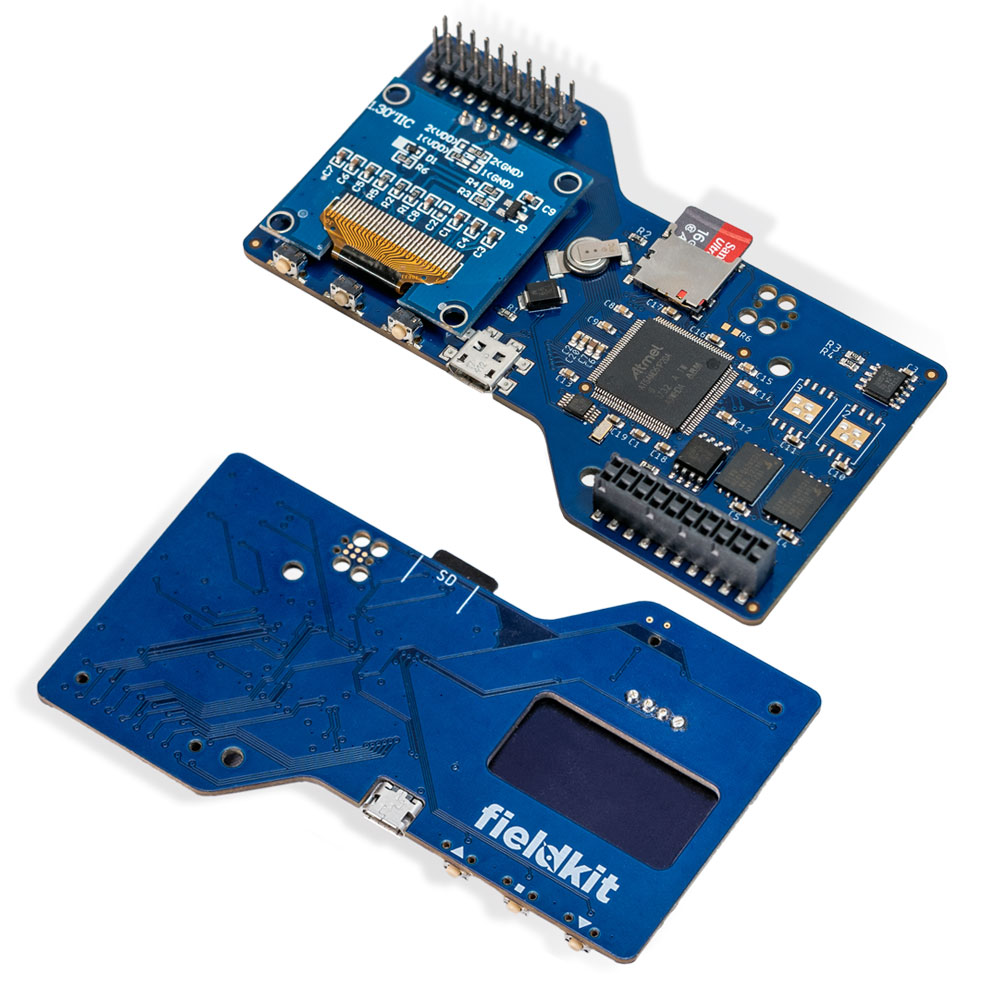

# FieldKit-*Upper*
The Upper board constitutes the thinky bits of the FieldKit system.

## Architecture
Every Fieldkit has at least three boards: Upper, Lower, and Module Base. Upper contains :

- The microcontroller.
- The OLED display and buttons.
- The real-time clock and its backup power supply.
- Flash memory for firmware.
- Separate NAND flash for data storage.
- The Micro-SD Card Slot.
- The USB Port.
- A temperature sensor.

## License Information

> *"In the long history of humankind (and animal kind, too) those who learned to collaborate and improvise most effectively have prevailed."*
>  --**Charles Darwin**

This hardware is released under **CERN Open Hardware License Version 2 - Permissive (CERN-OHL_P)**
Obviously, it's Distributed as-is; and no warranty is given.

---
*Upper was Designed by Bradley Gawthrop for FieldKit.*
